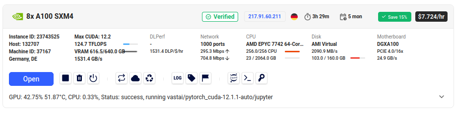

# improvements

## Local, 3050-Ti laptop, batch 4, context 256

### f32

```
44, loss: 6.516855716705322, dt: 360.79ms, tok/sec: 2838.193518032083
45, loss: 6.5268402099609375, dt: 360.60ms, tok/sec: 2839.741674766108
46, loss: 7.35074520111084, dt: 361.91ms, tok/sec: 2829.430048973558
47, loss: 7.092875957489014, dt: 360.42ms, tok/sec: 2841.1092092329145
48, loss: 7.262147426605225, dt: 360.89ms, tok/sec: 2837.462249573056
49, loss: 7.13644552230835, dt: 361.06ms, tok/sec: 2836.062640813728
```

### tf32

```
44, loss: 6.562320232391357, dt: 249.58ms, tok/sec: 4102.925753195912
45, loss: 6.517680644989014, dt: 248.01ms, tok/sec: 4128.855193841374
46, loss: 7.399937629699707, dt: 248.76ms, tok/sec: 4116.472913977042
47, loss: 7.174116611480713, dt: 247.78ms, tok/sec: 4132.621397038731
48, loss: 7.389693737030029, dt: 248.56ms, tok/sec: 4119.679071199531
49, loss: 7.250792026519775, dt: 249.57ms, tok/sec: 4102.984546103281
```

### bf16

```
44, loss: 6.5555877685546875, dt: 187.62ms, tok/sec: 5457.766220299741
45, loss: 6.509521484375, dt: 188.12ms, tok/sec: 5443.461454422862
46, loss: 7.3783721923828125, dt: 187.84ms, tok/sec: 5451.524592973001
47, loss: 7.1530914306640625, dt: 188.53ms, tok/sec: 5431.634606921182
48, loss: 7.3604736328125, dt: 187.13ms, tok/sec: 5472.160310673278
49, loss: 7.220672607421875, dt: 188.25ms, tok/sec: 5439.607605629878
```

### compile

```
44, loss: 6.559707164764404, dt: 158.85ms, tok/sec: 6446.441291159227
45, loss: 6.514993667602539, dt: 158.99ms, tok/sec: 6440.670098717705
46, loss: 7.3926239013671875, dt: 158.91ms, tok/sec: 6443.858927175588
47, loss: 7.16591739654541, dt: 158.73ms, tok/sec: 6451.292440289417
48, loss: 7.379026412963867, dt: 158.87ms, tok/sec: 6445.686678712714
49, loss: 7.239632606506348, dt: 159.26ms, tok/sec: 6429.919031807008
```

### flash attention

```
44, loss: 6.55976676940918, dt: 151.17ms, tok/sec: 6773.616438485789
45, loss: 6.514967918395996, dt: 151.66ms, tok/sec: 6751.967904720283
46, loss: 7.392707824707031, dt: 151.69ms, tok/sec: 6750.620128160595
47, loss: 7.165891647338867, dt: 151.77ms, tok/sec: 6747.131145120193
48, loss: 7.379010200500488, dt: 151.70ms, tok/sec: 6750.089655074865
49, loss: 7.239564418792725, dt: 151.28ms, tok/sec: 6768.972646522975
```

### vocab_size=50304

```
44, loss: 6.553337097167969, dt: 145.80ms, tok/sec: 7023.486416522898
45, loss: 6.521977424621582, dt: 146.59ms, tok/sec: 6985.606282051491
46, loss: 7.40291690826416, dt: 146.53ms, tok/sec: 6988.265962899266
47, loss: 7.2007246017456055, dt: 146.91ms, tok/sec: 6970.290102599557
48, loss: 7.422256946563721, dt: 146.54ms, tok/sec: 6987.74295973435
49, loss: 7.328115463256836, dt: 146.47ms, tok/sec: 6991.0187041694135
```

### larning rate, 3e-4

```
44, loss: 6.537600517272949, dt: 154.31ms, tok/sec: 6635.962238847018, norm: 1.2631, lr 4.4714e-05
45, loss: 6.522396087646484, dt: 154.75ms, tok/sec: 6617.048382623914, norm: 1.4077, lr 4.0276e-05
46, loss: 7.350337028503418, dt: 155.74ms, tok/sec: 6574.888931752286, norm: 1.2654, lr 3.6607e-05
47, loss: 7.179737091064453, dt: 155.43ms, tok/sec: 6588.151201905746, norm: 1.3664, lr 3.3730e-05
48, loss: 7.464401721954346, dt: 155.25ms, tok/sec: 6595.749350402044, norm: 1.3927, lr 3.1662e-05
49, loss: 7.412684917449951, dt: 155.27ms, tok/sec: 6595.070774324019, norm: 2.1585, lr 3.0416e-05
```

### larning rate, 6e-4

```
44, loss: 6.570123672485352, dt: 155.34ms, tok/sec: 6592.023967830064, norm: 1.4884, lr 8.9428e-05
45, loss: 6.587832927703857, dt: 154.68ms, tok/sec: 6620.261230252743, norm: 1.8381, lr 8.0553e-05
46, loss: 7.363733768463135, dt: 154.78ms, tok/sec: 6615.79468853156, norm: 1.4578, lr 7.3215e-05
47, loss: 7.19529914855957, dt: 155.17ms, tok/sec: 6599.0429332853955, norm: 1.9054, lr 6.7460e-05
48, loss: 7.399306297302246, dt: 155.06ms, tok/sec: 6604.085947566695, norm: 1.8287, lr 6.3324e-05
49, loss: 7.3701982498168945, dt: 154.61ms, tok/sec: 6623.007370946751, norm: 2.8968, lr 6.0832e-05
```

### decay optimizer

```
44, loss: 6.588419437408447, dt: 136.65ms, tok/sec: 7493.788214685145, norm: 1.3725, lr 8.9428e-05
45, loss: 6.562193870544434, dt: 137.26ms, tok/sec: 7460.166914472313, norm: 1.5644, lr 8.0553e-05
46, loss: 7.366515159606934, dt: 136.60ms, tok/sec: 7496.2994632992695, norm: 1.2969, lr 7.3215e-05
47, loss: 7.193835735321045, dt: 136.93ms, tok/sec: 7478.0007486763225, norm: 1.5271, lr 6.7460e-05
48, loss: 7.4247941970825195, dt: 136.82ms, tok/sec: 7484.399040874366, norm: 1.4835, lr 6.3324e-05
49, loss: 7.3491530418396, dt: 136.78ms, tok/sec: 7486.473340456722, norm: 2.3964, lr 6.0832e-05
```

### micro_batch

```
44, loss: 6.359553, dt: 823.16ms, tok/sec: 1243.9920940007553, norm: 1.0338, lr 8.9428e-05
45, loss: 6.376590, dt: 823.83ms, tok/sec: 1242.9764915035616, norm: 0.9846, lr 8.0553e-05
46, loss: 6.469552, dt: 823.28ms, tok/sec: 1243.8069226273803, norm: 1.3413, lr 7.3215e-05
47, loss: 6.397977, dt: 822.80ms, tok/sec: 1244.5234166325229, norm: 1.4767, lr 6.7460e-05
48, loss: 6.340066, dt: 823.56ms, tok/sec: 1243.3870689076175, norm: 1.3616, lr 6.3324e-05
49, loss: 6.231665, dt: 824.64ms, tok/sec: 1241.761463179107, norm: 1.0568, lr 6.0832e-05
```

### micro_batch (correction for the number of processed tokens)

```
44, loss: 6.359560, dt: 0.82398s, tok/sec: 9941.94173387511, norm: 1.0341, lr 8.9428e-05
45, loss: 6.376503, dt: 0.82088s, tok/sec: 9979.552324794497, norm: 0.9846, lr 8.0553e-05
46, loss: 6.469543, dt: 0.82199s, tok/sec: 9966.014462432973, norm: 1.3406, lr 7.3215e-05
47, loss: 6.397924, dt: 0.82278s, tok/sec: 9956.527767217158, norm: 1.4759, lr 6.7460e-05
48, loss: 6.340064, dt: 0.82266s, tok/sec: 9957.94456953153, norm: 1.3604, lr 6.3324e-05
49, loss: 6.231693, dt: 0.82237s, tok/sec: 9961.440688098422, norm: 1.0566, lr 6.0832e-05
```

### ddp, one node

```
44, loss: 6.359593, dt: 0.82056s, tok/sec: 9983.420413286534, norm: 1.0339, lr 8.9428e-05
45, loss: 6.376564, dt: 0.82022s, tok/sec: 9987.60503430286, norm: 0.9846, lr 8.0553e-05
46, loss: 6.469541, dt: 0.82018s, tok/sec: 9988.023108670868, norm: 1.3411, lr 7.3215e-05
47, loss: 6.397961, dt: 0.82089s, tok/sec: 9979.445081702246, norm: 1.4769, lr 6.7460e-05
48, loss: 6.340087, dt: 0.82049s, tok/sec: 9984.247192780835, norm: 1.3617, lr 6.3324e-05
49, loss: 6.231664, dt: 0.82240s, tok/sec: 9961.07970344979, norm: 1.0567, lr 6.0832e-05
```

## 1xA100, batch 52, context 1024

```
536, loss: 3.343842, dt: 0.39161s, tok/sec: 135970.8035, norm: 0.3171, lr 4.5063e-04
537, loss: 3.209078, dt: 0.39107s, tok/sec: 136159.0583, norm: 0.3532, lr 4.5147e-04
538, loss: 3.064547, dt: 0.39121s, tok/sec: 136112.3398, norm: 0.4511, lr 4.5231e-04
539, loss: 3.376788, dt: 0.39232s, tok/sec: 135726.1315, norm: 0.3779, lr 4.5315e-04
540, loss: 3.200054, dt: 0.39104s, tok/sec: 136169.9335, norm: 0.3591, lr 4.5399e-04
```

### GPU usage

```
Every 2.0s: nvidia-smi                                                                                                                                                      c2ed7d99c25f: Sun Jul 20 07:52:09 2025

Sun Jul 20 07:52:09 2025
+-----------------------------------------------------------------------------+
| NVIDIA-SMI 525.125.06   Driver Version: 525.125.06   CUDA Version: 12.0     |
|-------------------------------+----------------------+----------------------+
| GPU  Name        Persistence-M| Bus-Id        Disp.A | Volatile Uncorr. ECC |
| Fan  Temp  Perf  Pwr:Usage/Cap|         Memory-Usage | GPU-Util  Compute M. |
|                               |                      |               MIG M. |
|===============================+======================+======================|
|   0  NVIDIA A100-SXM...  On   | 00000000:03:00.0 Off |                  Off |
| N/A   60C    P0   426W / 400W |  70981MiB / 81920MiB |    100%      Default |
|                               |                      |             Disabled |
+-------------------------------+----------------------+----------------------+

+-----------------------------------------------------------------------------+
| Processes:                                                                  |
|  GPU   GI   CI        PID   Type   Process name                  GPU Memory |
|        ID   ID                                                   Usage      |
|=============================================================================|
|    0   N/A  N/A      1380      G   /opt/syncthing/syncthing            4MiB |
+-----------------------------------------------------------------------------+
```

## 8xA100, batch 104, context 1024 

Costed 27$ on vast.ai, 3.5 hours, 160Gb storage



```bash
pip install tiktoken datasets transformer matplotlib
pip install --upgrade torch
```


```
1755, loss: 5.387751, dt: 0.52687s, tok/sec: 1617032.7642, norm: 1.1712, lr 5.9574e-04
1756, loss: 5.356755, dt: 0.53066s, tok/sec: 1605474.0612, norm: 1.6105, lr 5.9573e-04
1757, loss: 5.375816, dt: 0.53036s, tok/sec: 1606386.3182, norm: 1.7086, lr 5.9572e-04
1758, loss: 5.378245, dt: 0.52960s, tok/sec: 1608701.1949, norm: 1.1126, lr 5.9571e-04
1759, loss: 5.427108, dt: 0.52928s, tok/sec: 1609658.4523, norm: 1.3387, lr 5.9570e-04
1760, loss: 5.434827, dt: 0.53168s, tok/sec: 1602419.3559, norm: 1.6075, lr 5.9569e-04
1761, loss: 5.400561, dt: 0.53126s, tok/sec: 1603678.5610, norm: 1.9469, lr 5.9569e-04
1762, loss: 5.387246, dt: 0.52986s, tok/sec: 1607920.8697, norm: 1.2717, lr 5.9568e-04
1763, loss: 5.413312, dt: 0.52976s, tok/sec: 1608227.6976, norm: 1.6889, lr 5.9567e-04
1764, loss: 5.409798, dt: 0.53150s, tok/sec: 1602959.1839, norm: 1.6183, lr 5.9566e-04
1765, loss: 5.396745, dt: 0.53077s, tok/sec: 1605141.6051, norm: 1.5195, lr 5.9565e-04
1766, loss: 5.382699, dt: 0.53039s, tok/sec: 1606298.2228, norm: 1.3021, lr 5.9564e-04
1767, loss: 5.302884, dt: 0.53007s, tok/sec: 1607282.2617, norm: 1.2573, lr 5.9564e-04
1768, loss: 5.290673, dt: 0.53074s, tok/sec: 1605236.7845, norm: 1.3432, lr 5.9563e-04
```

### GPU usage

```
Every 2.0s: nvidia-smi                                                                                                                                                      639a86875977: Mon Jul 21 16:45:59 2025

Mon Jul 21 16:45:59 2025
+---------------------------------------------------------------------------------------+
| NVIDIA-SMI 535.247.01             Driver Version: 535.247.01   CUDA Version: 12.2     |
|-----------------------------------------+----------------------+----------------------+
| GPU  Name                 Persistence-M | Bus-Id        Disp.A | Volatile Uncorr. ECC |
| Fan  Temp   Perf          Pwr:Usage/Cap |         Memory-Usage | GPU-Util  Compute M. |
|                                         |                      |               MIG M. |
|=========================================+======================+======================|
|   0  NVIDIA A100-SXM4-80GB          On  | 00000000:07:00.0 Off |                    0 |
| N/A   64C    P0             405W / 400W |  78222MiB / 81920MiB |     98%      Default |
|                                         |                      |             Disabled |
+-----------------------------------------+----------------------+----------------------+
|   1  NVIDIA A100-SXM4-80GB          On  | 00000000:0F:00.0 Off |                    0 |
| N/A   58C    P0             428W / 400W |  78222MiB / 81920MiB |     99%      Default |
|                                         |                      |             Disabled |
+-----------------------------------------+----------------------+----------------------+
|   2  NVIDIA A100-SXM4-80GB          On  | 00000000:47:00.0 Off |                    0 |
| N/A   60C    P0             288W / 400W |  78222MiB / 81920MiB |     99%      Default |
|                                         |                      |             Disabled |
+-----------------------------------------+----------------------+----------------------+
|   3  NVIDIA A100-SXM4-80GB          On  | 00000000:4E:00.0 Off |                    0 |
| N/A   60C    P0             440W / 400W |  78222MiB / 81920MiB |    100%      Default |
|                                         |                      |             Disabled |
+-----------------------------------------+----------------------+----------------------+
|   4  NVIDIA A100-SXM4-80GB          On  | 00000000:87:00.0 Off |                    0 |
| N/A   71C    P0             401W / 400W |  78222MiB / 81920MiB |     99%      Default |
|                                         |                      |             Disabled |
+-----------------------------------------+----------------------+----------------------+
|   5  NVIDIA A100-SXM4-80GB          On  | 00000000:90:00.0 Off |                    0 |
| N/A   72C    P0             392W / 400W |  78222MiB / 81920MiB |    100%      Default |
|                                         |                      |             Disabled |
+-----------------------------------------+----------------------+----------------------+
|   6  NVIDIA A100-SXM4-80GB          On  | 00000000:B7:00.0 Off |                    0 |
| N/A   72C    P0             374W / 400W |  78222MiB / 81920MiB |    100%      Default |
|                                         |                      |             Disabled |
+-----------------------------------------+----------------------+----------------------+
|   7  NVIDIA A100-SXM4-80GB          On  | 00000000:BD:00.0 Off |                    0 |
| N/A   73C    P0             422W / 400W |  78222MiB / 81920MiB |    100%      Default |
|                                         |                      |             Disabled |
+-----------------------------------------+----------------------+----------------------+

+---------------------------------------------------------------------------------------+
| Processes:                                                                            |
|  GPU   GI   CI        PID   Type   Process name                            GPU Memory |
|        ID   ID                                                             Usage      |
|=======================================================================================|
+---------------------------------------------------------------------------------------+
```

### evaluation history

```
rank 0 sample 0: Hello, I'm a language model, and I know that it's really just in real life. I understand that, in fact, there's more to that
rank 0 sample 1: Hello, I'm a language model, this year's post will be published Saturday, March, Feb. 7, 2020, and Wednesday, December 9, 2020
rank 0 sample 2: Hello, I'm a language model, which is about an algebra for elementary schools. That's the reason it's a language. It's a language that is
rank 0 sample 3: Hello, I'm a language model, it also includes some of the following definitions of its own:
- In English it contains four subclasses: English &
rank 5 sample 0: Hello, I'm a language model, but we are not aware of the difference between a standard and a standard, but the type of data that is defined.
rank 5 sample 1: Hello, I'm a language model, using one thing. However, this does not change the meaning of making the story easier than the definition. However, I
rank 5 sample 2: Hello, I'm a language model, an independent of a product, based on the definition of the product (including a variety of products and services) and on
rank 5 sample 3: Hello, I'm a language model, i.e. and a lot of people who work together to find out about a specific problem such as a particular subject
4000, loss: 3.995304, dt: 4.70163s, tok/sec: 181207.0214, norm: 0.5991, lr 5.5845e-04
4001, loss: 4.028201, dt: 0.53223s, tok/sec: 1600764.7619, norm: 0.6603, lr 5.5842e-04

```

```
rank 2 sample 2: Hello, I'm a language model, but I've never had the same ideas the way that I'd seen today. So I've found my ideas."I                                                                            
rank 2 sample 3: Hello, I'm a language model, a little out of a few, a bit of stuff. We're not as fortunate to call ourselves the same, though                                                                    
rank 3 sample 0: Hello, I'm a language model, and I'm not the original language of the day, but also a lexical language." -Pond, a lex                                                                            
rank 3 sample 1: Hello, I'm a language model, and that I'm a speaker on my own. I do not think I'm a speaker on my own. You know                                                                                  
rank 3 sample 2: Hello, I'm a language model, and it can be created here so that each chapter contains one paragraph. The title includes the first seven chapters of one-                                         
rank 3 sample 3: Hello, I'm a language model, and have a great place. So I've never had this to write to you it."—Sarr, in a                                                                                      
rank 5 sample 0: Hello, I'm a language model, a computer model, and a computer simulation. I know it's all there. But I don't know.                                                                               
We                                                                                                       
rank 5 sample 1: Hello, I'm a language model, there's only one of this one. The one I have in common, isn't the same thing. For the first                                                                         
rank 5 sample 2: Hello, I'm a language model, of the more recent National Geographic news releases.      
"The only major threat facing this century is the lack of a scientific                                   
rank 5 sample 3: Hello, I'm a language model, to the effect.                          
If I were a math fan and I've had this chance of being good at it.                    
                                                                                                         
5000, loss: 3.794011, dt: 4.71382s, tok/sec: 180738.4135, norm: 0.6271, lr 5.3060e-04 
5001, loss: 3.782270, dt: 0.53463s, tok/sec: 1593565.4641, norm: 0.6184, lr 5.3057e-04  

```

```
rank 3 sample 0: Hello, I'm a language model, I'm a linguist who is passionate about linguistics and, of course, the subject of linguistics, I don
rank 3 sample 1: Hello, I'm a language model, I can learn from my classroom teachers and I'm working in a classroom setting. I'm working in a classroom on how
rank 3 sample 2: Hello, I'm a language model, I've seen language with you guys. For every book I wrote, there has been a different perspective on language; but
rank 3 sample 3: Hello, I'm a language model, I always make it interesting, really interesting. It's always interesting, really interesting. We want to read, really interesting
rank 4 sample 0: Hello, I'm a language model, and I love to teach a language to you, so I've got your child using an iPhone and it's not my
rank 4 sample 1: Hello, I'm a language model, And if you listen to a talk I want you to translate the sentences down and get it down. It's time for
rank 4 sample 2: Hello, I'm a language model, you try to go with me. The only way to do that is to go for some data from where you put your
rank 4 sample 3: Hello, I'm a language model, I think? Is my language a form of expression/experience/determinism? Is my language a form of
rank 0 sample 0: Hello, I'm a language model, I'm trying to understand and be able to connect it to the Internet. The Internet can be the world of things we
rank 0 sample 1: Hello, I'm a language model, and we're looking at the relationship between language use behaviour and the effect of language use. This study explores the relationship between
rank 0 sample 2: Hello, I'm a language model, and I will always choose and take notes. You can't write in your own words. I'm not a linguist
rank 0 sample 3: Hello, I'm a language model, and, according to my theory, can you not find a method to model language?".
|What this means: How
10000, loss: 3.436789, dt: 5.25793s, tok/sec: 162034.8459, norm: 0.4230, lr 3.2510e-04
10001, loss: 3.437866, dt: 0.55608s, tok/sec: 1532091.8764, norm: 0.3924, lr 3.2506e-04
10002, loss: 3.442677, dt: 0.52922s, tok/sec: 1609843.3682, norm: 0.3705, lr 3.2501e-04
```

```
rank 2 sample 0: Hello, I'm a language model, to which the human mind is a component, but in this case, one can see that the brain is involved in some
rank 2 sample 1: Hello, I'm a language model, I'm linguist, and I need basic language teaching skills for every type of child. But what do you do differently
rank 2 sample 2: Hello, I'm a language model, so I'll get the language of what?        
- And you'll say "That's a fun challenge, one where                                                      
rank 2 sample 3: Hello, I'm a language model, I like                                                     
the idea that the first of the things I did was to start my career looking back on it,              
                                                                                                         
rank 3 sample 0: Hello, I'm a language model, and I'm not interested enough to help you with my projects. 
Berg is for students who already know a thing                                                            
rank 3 sample 1: Hello, I'm a language model, and if it's not I would like to use it, I'm going to use it. If you're having difficulties
rank 3 sample 2: Hello, I'm a language model, and it works by defining the words in two sets of words:
1. For example, this sentence, then you                                                                  
rank 3 sample 3: Hello, I'm a language model, and also a teacher. I was given a chance to see how it's being shared across classes. Can I share my
rank 0 sample 0: Hello, I'm a language model, and I can't think of myself if I get this
out about reading it. So, in my next post about
rank 0 sample 1: Hello, I'm a language model, I'd like to learn languages that better understand and can apply to other communities of learners and in our local language.

rank 0 sample 2: Hello, I'm a language model, so I get the concepts like ‘language theory’ to apply to my current situation.
I'm going to
rank 0 sample 3: Hello, I'm a language model, I learned a lot about the world from a variety of sources. You could just give yourself a little bit of information without
14000, loss: 3.321983, dt: 4.71630s, tok/sec: 180643.2366, norm: 0.3561, lr 1.5551e-04
14001, loss: 3.360485, dt: 0.53220s, tok/sec: 1600845.0797, norm: 0.3081, lr 1.5548e-04
```

```
rank 0 sample 0: Hello, I'm a language model, and I am a computer-oriented user . That's how I used to say, I remember when you first started,
rank 3 sample 0: Hello, I'm a language model, and I'm not the best model."
"We were born with small (nonwhite) minds", he says,
rank 0 sample 1: Hello, I'm a language model, I'd like to hear from you for a minute? Let's see what we can find out!
We can't
rank 3 sample 1: Hello, I'm a language model, and so on.
From Wikipedia, the free encyclopedia<|endoftext|>The term “sustainability” is now commonly
rank 0 sample 2: Hello, I'm a language model, I'm from a single world. My mother always insisted that a single person should never speak another language. I think it
rank 3 sample 2: Hello, I'm a language model, and it works by assuming that everything is independent of any one person. I mean, I mean your model is dependent on
rank 0 sample 3: Hello, I'm a language model, so how do you use it to your own thinking?
3. Write the key word -I mean, what makes
rank 3 sample 3: Hello, I'm a language model, and most of them are about computers.
- What about people with high- or low-level writing?
-
17000, loss: 3.317719, dt: 4.70864s, tok/sec: 180937.1395, norm: 0.3469, lr 7.6812e-05
17001, loss: 3.332175, dt: 0.53206s, tok/sec: 1601256.8348, norm: 0.3505, lr 7.6796e-05
17002, loss: 3.321540, dt: 0.52939s, tok/sec: 1609342.3807, norm: 0.3518, lr 7.6780e-05
17003, loss: 3.338798, dt: 0.52855s, tok/sec: 1611900.6097, norm: 0.3740, lr 7.6764e-05
17004, loss: 3.295957, dt: 0.52912s, tok/sec: 1610162.5388, norm: 0.3603, lr 7.6748e-05
17005, loss: 3.280436, dt: 0.53050s, tok/sec: 1605961.8165, norm: 0.3429, lr 7.6732e-05
17006, loss: 3.305845, dt: 0.53021s, tok/sec: 1606842.8355, norm: 0.3740, lr 7.6716e-05
17007, loss: 3.284870, dt: 0.52972s, tok/sec: 1608331.9299, norm: 0.3782, lr 7.6700e-05
```

```
rank 2 sample 2: Hello, I'm a language model, so I can understand what it says but never quite understood. But the reason it doesn't explain this is because they didn
rank 2 sample 3: Hello, I'm a language model, I want to be an English speaker, so I get to say, 'Look, it comes out right there, '
rank 4 sample 1: Hello, I'm a language model, now, I look like a teacher, so what does that mean? A good thing for a language classroom, what is
rank 3 sample 0: Hello, I'm a language model, and I'm not the best. There are a couple of tools I've helped my student get with an English tutor like
rank 4 sample 2: Hello, I'm a language model, but because I get so busy with other language training, I think it's a nice way to help those who do it
rank 3 sample 1: Hello, I'm a language model, and so on.
With an editor's own editor, I'm hoping to publish my own ideas.
A few
rank 3 sample 2: Hello, I'm a language model, and it was hard to figure out how to apply that. In the case of ELLs, it was too much
rank 4 sample 3: Hello, I'm a language model, and the challenge this student faces is simply to create meaningful solutions instead. However, I'm also learning to be human and
rank 3 sample 3: Hello, I'm a language model, and also a programming language for computing. I can do math and statistics. I can also be a graphics engineer and a
rank 0 sample 0: Hello, I'm a language model, and I don't think any of those, they're out of step with you. And how are we using it now
rank 0 sample 1: Hello, I'm a language model, so that's a great way to add a new type of vocabulary in the mix. So it's kind of a bit
rank 0 sample 2: Hello, I'm a language model, so I used a program and all of the people I worked as I had to do.
I loved the program,
rank 0 sample 3: Hello, I'm a language model, I believe that you can build your own, on the basis of experience, in accordance with the demands of the classroom on
18000, loss: 3.373334, dt: 4.69173s, tok/sec: 181589.3709, norm: 0.3754, lr 6.4539e-05
18001, loss: 3.273160, dt: 0.52974s, tok/sec: 1608274.7452, norm: 0.3834, lr 6.4531e-05
18002, loss: 3.305362, dt: 0.53007s, tok/sec: 1607283.7076, norm: 0.3903, lr 6.4522e-05
18003, loss: 3.294872, dt: 0.53066s, tok/sec: 1605499.3075, norm: 0.3875, lr 6.4514e-05
```

```
rank 4 sample 3: Hello, I'm a language model, and so's easy to implement. With these languages are, most people recognize them as a new set of words. So
rank 2 sample 3: Hello, I'm a language model, so we look at how we can build upon the material, from the perspective of the reader they follow, with the aid
rank 3 sample 0: Hello, I'm a language model, and I'm not aware if you find these things to be grammatically wrong. So this language model also includes grammar points
rank 3 sample 1: Hello, I'm a language model, and you have to be more open to new concepts. Your language is a natural language, and you can develop some ideas
rank 3 sample 2: Hello, I'm a language model, and it was written by a French-speaking countrymen, in the late 1800s. In New Orleans, people are
rank 3 sample 3: Hello, I'm a language model, and most of them are still, at the same time and many more are still out there, and those languages are still
rank 0 sample 0: Hello, I'm a language model, and I don't have many friends at me at any level, either. The language models are easy, but I've
rank 0 sample 1: Hello, I'm a language model, so there's a lot of things I can't cover as much with word clouds, but you'll understand what I mean
rank 0 sample 2: Hello, I'm a language model, I'm on the block; I'll be speaking a language; my parents are friends; my parents are friends. I
rank 0 sample 3: Hello, I'm a language model, so how do I get this to happen?" After a few weeks of trying and planning my best to try and make learning
19000, loss: 3.248460, dt: 4.72090s, tok/sec: 180467.2998, norm: 0.3462, lr 6.0021e-05
19001, loss: 3.279863, dt: 0.53103s, tok/sec: 1604383.4569, norm: 0.3091, lr 6.0020e-05
19002, loss: 3.248457, dt: 0.52941s, tok/sec: 1609267.7305, norm: 0.3774, lr 6.0020e-05
```

```
rank 2 sample 1: Hello, I'm a language model, I'm familiar with it. I'd normally be well versed with its syntax, but I'd have a lot of
rank 2 sample 2: Hello, I'm a language model, so I don't want to give out English in a moment. So instead, make a letter about yourself that just might
rank 2 sample 3: Hello, I'm a language model, I mean by the words "I", i.e. in the language spoken on campus the learners can easily differentiate between
rank 3 sample 0: Hello, I'm a language model, and I'm not interested at all in using the same language in my school - so please be positive:                                                                      In an                                                                                                                                                                                                             
rank 3 sample 1: Hello, I'm a language model, and so on.
Is language learning a form of knowledge? I'm a language model, and so on...
rank 3 sample 2: Hello, I'm a language model, and it was not perfect. For example, as the saying goes, 'It's not your grammar.' But now it
rank 3 sample 3: Hello, I'm a language model, and thanks to this post, I'm a linguist for pointing this out.
As it turns out, I've
19072, loss: 3.265918, dt: 13.06611s, tok/sec: 65204.4098, norm: 0.3485, lr 6.0000e-05
```
